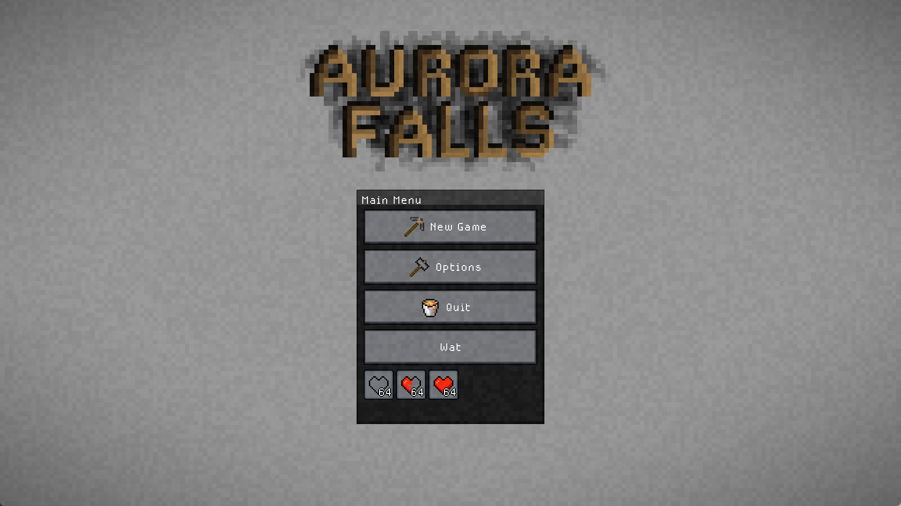
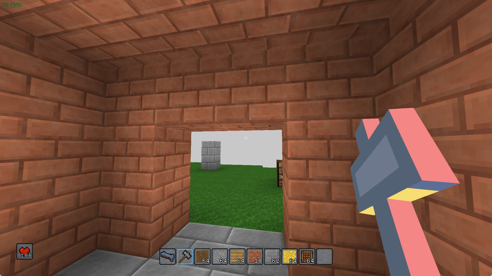
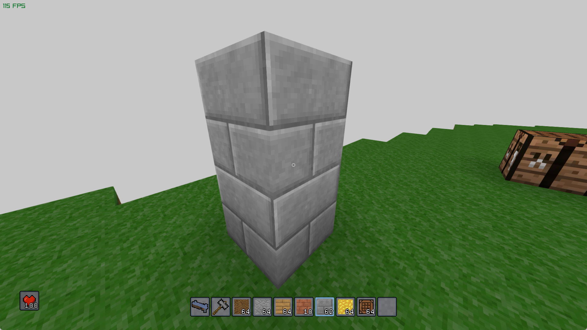
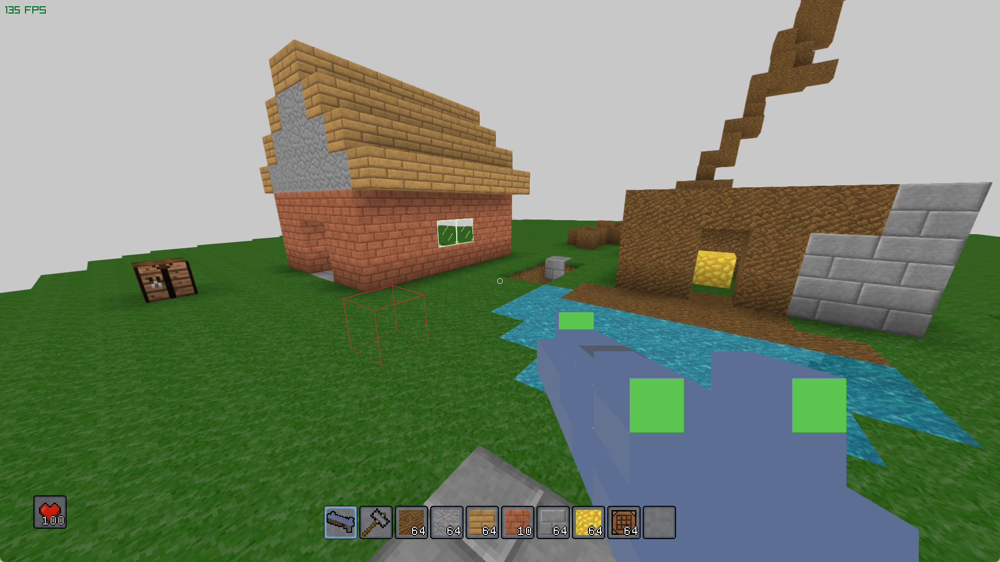

# Voxelgine

Voxelgine is a voxel-based sandbox engine and game written in modern C# (.NET 9),
featuring real-time 3D rendering with Raylib, a modular entity system, and a fully interactive world.

Players can explore, build, and modify a procedurally generated floating island environment,
interact with blocks and entities, and use a variety of tools and weapons.

The engine includes a custom GUI system, inventory management, physics-based player movement,
and support for custom models, textures, and shaders.

Voxelgine is designed for extensibility and experimentation with voxel game mechanics.

