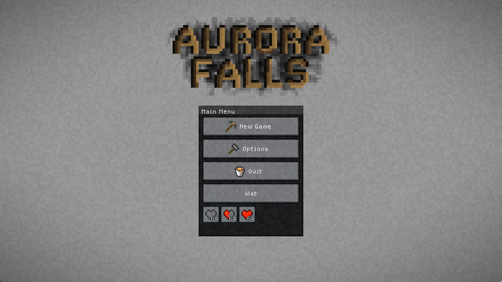

[](https://deepwiki.com/sbarisic/RaylibGame)

# Aurora Falls - Voxelgine

Aurora Falls is a C#/.NET voxel sandbox with procedural worlds, Quake-style
movement, server-authoritative multiplayer, entities, combat, and a dedicated
headless server.

The client has been migrated in place from Raylib to
[FishGfx](https://github.com/sbarisic/FishGfx). The production client contains
no Raylib package or compatibility path. It targets Windows x64, while the
shared engine and dedicated server remain portable `net10.0` projects.



## Highlights

- Procedural, mutable 16x16x16 voxel chunks with dual-channel lighting
- Server-authoritative networking, prediction, interpolation, and combat
- Quake-style ground/air movement, swimming, collision, and ray queries
- FishGfx voxel rendering, real MSAA, post-processing, and FishUI integration
- A custom high-level audio API over a narrow native miniaudio shim
- Streamed ambience and basic positional 3D audio, with a future Steam Audio seam
- Indexed, independently compressed world columns with spatial client streaming
- A graphics-free dedicated server that can publish and run on Windows or Linux

## Repository layout

```text
RaylibGame.sln
|- Voxelgine/                 Windows x64 client and game-specific adapters
|- VoxelgineEngine/           Portable world, simulation, entities, networking, and contracts
|- VoxelgineServer/           Portable dedicated server
|- Voxelgine.Audio/           Managed high-level audio layer
|- native/VoxelAudioNative/   Narrow C ABI implemented with miniaudio
|- UnitTest/                  Windows client and integration tests
|- VoxelgineEngine.Tests/     Portable engine/world/network tests
|- Voxelgine.Audio.Tests/     Audio contract and native integration tests
`- thirdparty/
   |- FishGfx/                Pinned FishGfx submodule, including nested FishUI
   `- miniaudio/              Pinned miniaudio submodule
```

`ChunkMap` remains authoritative for simulation, collision, saves, and network
data. The FishGfx `VoxelWorld` is a client-owned rendering mirror; it is never a
serialization or gameplay authority. See [Architecture](docs/ARCHITECTURE.md)
for the ownership and headless-boundary rules.

## Quick start

The clone must include recursive submodules:

```powershell
git clone --recurse-submodules https://github.com/sbarisic/RaylibGame.git
Set-Location RaylibGame
git submodule status --recursive
```

For an existing clone:

```powershell
git submodule sync --recursive
git submodule update --init --recursive
```

Do not use `git submodule update --remote`. The parent repositories deliberately
pin exact dependency commits.

Windows client requirements are the .NET 10 SDK, the .NET 9 targeting pack for
the pinned nested FishUI project, CMake, and the Visual Studio
2022 MSVC x64 C/C++ toolchain. Build and run the FishGfx client with:

```powershell
dotnet build Voxelgine/Voxelgine.csproj -c Release `
  -f net10.0-windows10.0.17763.0 -p:Platform=x64
dotnet run --project Voxelgine/Voxelgine.csproj -c Release `
  -f net10.0-windows10.0.17763.0
```

Run the portable dedicated server with:

```powershell
dotnet run --project VoxelgineServer/VoxelgineServer.csproj -c Release -- `
  --port 7777 --seed 666
```

The complete toolchain, publish, test, and package-audit commands are in
[Building and validation](docs/BUILDING.md).

## Migration documentation

- [Architecture and migration invariants](docs/ARCHITECTURE.md)
- [Dependency pins and upstream workflow](docs/DEPENDENCIES.md)
- [Audio architecture and cue bank](docs/AUDIO.md)
- [Models, shaders, and asset conversion](docs/ASSETS.md)
- [Building, testing, publishing, and package audits](docs/BUILDING.md)
- [World archive and spatial streaming](docs/WORLD_STREAMING.md)

## Controls

| Input | Action |
|---|---|
| WASD | Move |
| Mouse | Look |
| Space | Jump or swim up |
| Shift | Walk, swim down, or ledge safety |
| C | Toggle noclip |
| 1-4 | Select hotbar slot |
| Left mouse | Use item or break block |
| Right mouse | Place block |
| F1 | Toggle debug menu |
| F3 | Toggle debug mode |
| F5 | Toggle network/renderer statistics |
| Escape | Return to the main menu |

## License

This project is for educational and experimental purposes. See [LICENSE](LICENSE).
