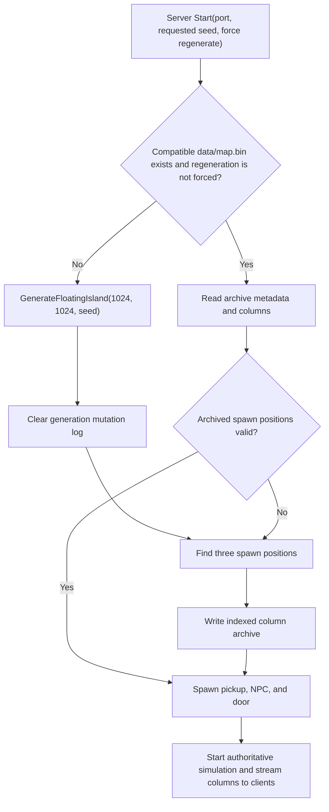

# World generation

This document describes the world-generation system currently implemented in
Aurora Falls, how a generated world enters the authoritative server lifecycle,
and where the implementation differs from the intended world design. It is an
analysis of the current code, not a proposed replacement specification.

Analysis baseline: repository commit `6af5e96` (`2026-07-20`), updated for the
natural world-generation revision described below.

## Executive summary

Aurora Falls generates one finite floating island on the authoritative server.
The generator eagerly creates a dense chunk grid, fills a noise-shaped stone
mass, adds a shallow natural surface, then places ponds, dirt roads, trees, and
foliage. Spawn positions are selected in a separate deterministic surface scan.
The complete result is saved to `data/map.bin`; clients never regenerate terrain
from the seed and instead receive authoritative columns from the server.

The implementation provides a useful procedural terrain baseline, but it is not
yet the hybrid procedural/hand-authored world described in
[WORLDBUILDING.md](WORLDBUILDING.md). It has no biomes, material deposits,
vertical gameplay strata, fixed artifacts, structures, ruins, or feature-aware
points of interest. Its generated "roads" are random dirt traces rather than
connections between meaningful locations.

The most important technical findings are:

1. Sequential generation is deterministic for a fixed seed and runtime,
   including tree selection, tree shapes, ponds, and foliage. The remaining
   seed risk is the process-global mutable `Noise.Seed` state.
2. The 1024 x 1024 default eagerly allocates 64 x 5 x 64 = 20,480 chunks and
   83,886,080 `PlacedBlock` cells before generation. With the current 28-byte
   effective `PlacedBlock` layout, the block arrays alone are approximately
   2.19 GiB, excluding array/object overhead, chunk metadata, snapshots, save
   buffers, and client mirrors.
3. Generation is whole-world and startup-only. Spatial column streaming reduces
   network and client startup cost, but it does not make terrain generation or
   authoritative server storage incremental.
4. Generation cancellation is observable but not transactional. Cancellation
   after allocation can leave a partially mutated map, and `WorldReset` is
   raised from `finally` even when generation fails.
5. Automated coverage now verifies compact-world hashes, strict tree spacing,
   natural pond planning, falloff, flooring, early cancellation, reset events,
   snapshots, archives, and streaming. Default-size resource cost and subjective
   generation quality remain untested.

## Ownership and lifecycle

`ChunkMap` is the sole authoritative block store. World generation lives in
[`ChunkMap.Generation.cs`](VoxelgineEngine/Engine/World/ChunkMap.Generation.cs),
noise in [`Noise.cs`](VoxelgineEngine/Engine/Noise.cs), and server startup in
[`ServerLoop.cs`](VoxelgineEngine/Engine/Server/ServerLoop.cs).



Startup behavior has several consequences:

- The default requested seed is `666`; `VoxelgineServer --seed <value>` changes
  it for a newly generated world.
- If a compatible archive exists, its archived seed and spawn positions win.
  Supplying another `--seed` does not replace that world. Use `--force-regen` to
  intentionally generate and overwrite it.
- An incompatible archive is moved to a timestamped `.bak` file before a new
  world is generated. The current archive version is 2.
- The generator runs on the server, not on clients. This avoids requiring client
  and server generator parity and preserves all player changes.
- A successful generation emits one `WorldReset`, initializes every generated
  column at revision 1, emits no per-block changes, clears pending changes, finds
  spawn positions, and immediately saves the result.

## World dimensions and storage

The server constants define a 1024 x 1024 horizontal world. The generator uses
a fixed terrain height of 64 blocks and 16 x 16 x 16 chunks.

`CreateChunkGrid` rounds horizontal dimensions up to whole chunks and allocates
one extra vertical air chunk so trees can extend above the terrain ceiling:

```text
chunks X = ceil(width / 16)
chunks Z = ceil(length / 16)
chunks Y = ceil(64 / 16) + 1 = 5
```

For the default dimensions this is:

| Quantity | Value |
|---|---:|
| Horizontal columns | 64 x 64 = 4,096 |
| Chunks | 64 x 5 x 64 = 20,480 |
| Allocated block cells | 83,886,080 |
| Approximate block-array payload | 2.19 GiB |
| Surface-height scratch array | 4 MiB |

The estimate uses the current `PlacedBlock` fields: a block type plus six
four-byte directional light values, with alignment producing 28 bytes per cell.
It deliberately excludes managed-array overhead and every later copy.

All chunks are allocated, including completely empty chunks and an initially
empty top layer that is available for tall trees. The optimization avoids
dictionary lookup and normal `SetBlock` mutation
bookkeeping during generation, but trades that work for a very large dense
allocation. The two terrain passes operate in parallel over X; later feature
passes are sequential.

Widths and lengths are not validated. Non-multiples of 16 produce padded chunk
cells outside the requested dimensions; those cells remain air but are still
part of the authoritative columns and spawn-search bounds. Calling generation a
second time on a populated `ChunkMap` is also unsupported because the generator
adds chunks without first clearing existing ones.

## Generation pipeline

Pass order matters because later features only accept particular surface block
types. Ponds reserve water and sand first, roads replace remaining grass/dirt,
trees require remaining grass, and foliage fills only still-empty space above
remaining grass.


### 1. Dense chunk grid

`CreateChunkGrid` constructs every chunk before any terrain is sampled. Direct
array indexing then gives each pass O(1) block access without creating mutation
events, neighbor updates, or per-edit lighting work.

### 2. Stone island and caves

`GenerateIslandShape` evaluates every `(x, y, z)` in the 1024 x 64 x 1024
terrain volume. It combines:

- two-octave 3D simplex density at scale `0.02`;
- radial falloff from the horizontal world center, divided by `1.2` to soften
  the island boundary;
- a vertical falloff beginning at normalized height `0.8`;
- 2D hill displacement at scale `0.012`, with an amplitude of +/-6 blocks; and
- one-octave cave noise at scale `0.08`.

A cell becomes stone when density is greater than `0.1` and cave noise is less
than `0.65`. The result is a rounded floating mass with noise-carved voids and a
height-displaced upper boundary.

There are two details worth preserving when changing this pass:

- The center-falloff distance includes the transformed vertical coordinate,
  not only X/Z distance. Its effect is small in the 1024-wide default but much
  stronger for small test worlds.
- Vertical falloff is a clamped linear interpolation: density is unchanged
  through `0.8`, reaches `0.5` at `0.9`, and reaches zero at `1.0`.

### 3. Surface material

`ApplySurfaceLayer` scans each X/Z column downward. The first non-air cell is
changed to grass and recorded in a flat `surfaceHeight[x * length + z]` array.
The next three contiguous solid cells become dirt. Deeper cells stay stone.

The scan stops at the first air cell after finding the surface, so only the
uppermost contiguous shell is surfaced. Internal cave floors and disconnected
lower masses remain stone, which is consistent with treating this as an exterior
surface pass rather than a general exposed-face material pass.

### 4. Ponds

Pond centers are sampled every three blocks with these settings:

| Setting | Value |
|---|---:|
| Center noise scale / threshold | `0.015` / `0.72` |
| Minimum center spacing | 40 blocks |
| Edge margin | 12 blocks |
| Radius | 5-10 blocks |
| Minimum accepted water area | 24 blocks |
| Maximum water depth | 4 blocks |

Each candidate receives a deterministic 5-10 block search radius. The planner
flood-fills connected surface cells below a water plane one block above the
candidate. It accepts the region only when higher terrain completely encloses
it before the search boundary, at least 24 cells would be wet, and no water
column exceeds four blocks. Rejected candidates do not reserve the 40-block
spacing, and a world may contain no ponds.

Accepted ponds do not excavate terrain. Existing surface blocks become a solid
sand bed, air above them is filled to one flat water plane, and adjacent
grass/dirt rim blocks become sand. The shared surface-height array is updated to
the water plane for every wet cell, so roads and vegetation consistently avoid
the pond.

### 5. Roads

Road candidates are noise-selected grass positions sampled every four blocks:

| Setting | Value |
|---|---:|
| Waypoint noise scale / threshold | `0.025` / `0.78` |
| Minimum waypoint spacing | 20 blocks |
| Edge margin | 10 blocks |
| Half-width | 1 block |

Each waypoint selects its nearest waypoint whose pair has not already been
used. A Bresenham line follows the recorded surface height and applies a 3 x 3
brush at each step.

Current behavior differs from names and comments in three ways:

- The pass writes `Dirt`, not `Plank`.
- Waypoints are noise samples, not actual points of interest.
- One nearest-unused edge per iterated waypoint does not guarantee a single
  connected road graph or purposeful routes.

`Random(seed + 3)` is constructed but never used. Pair keys encode coordinates
as `x * 10000 + z`, which is collision-free for the default dimensions but is
an unnecessary hidden size assumption.

### 6. Trees

Tree candidates require grass, sufficient vertical space, a four-block edge
margin, noise at scale `0.08` above `0.62`, and strict ten-block spacing. All
candidates are deterministically shuffled before a spatial-bucket pass accepts
them, preventing scan-direction bias while enforcing the Euclidean XZ distance
against every nearby selected trunk. Accepted positions are sorted before a
separate seeded stream chooses each shape:

- trunk height: 6-10 blocks;
- canopy radius: 2-3 blocks;
- canopy height: 3-5 blocks; and
- roughly spherical leaf layers, written only into air.

The grass under the trunk becomes dirt. Trees exactly ten blocks apart are
allowed; any pair closer than ten blocks is rejected. Position selection and
tree shape are deterministic for a fixed runtime and seed.

### 7. Foliage

Foliage requires grass with air above, a two-block edge margin, and noise at
scale `0.12` above `0.35`. It then accepts random values 0 through 20 from a
0-through-99 draw, an effective 21% chance.

The final chance draw uses a dedicated world-seeded foliage stream. It no longer
shares or consumes tree/pond randomness, so the foliage subset repeats for a
fixed seed and runtime.

### 8. Lighting and publication

The generator calls `ResetLighting`, not `ComputeLighting`; the old compute call
is commented out. Lighting is not part of archive column payloads. Client-side
stream application and rendering own the later lighting publication path, while
the authoritative world retains block types and fog as its durable state.

After generation, `InitializeColumnRevisions` records every X/Z column at
revision 1. Because generation uses direct chunk writes inside a bulk reset, it
does not flood normal mutation logs or emit one event per generated block.

## Noise and seed behavior

`Noise.Seed` is global mutable static state. Setting it replaces a shared
512-byte lookup table; generation then reads that table concurrently in the
parallel terrain and surface passes.

The current seed contract is therefore narrower than it appears:

- Terrain, ponds, roads, trees, and foliage are repeatable within the current
  runtime when generation is isolated. Feature passes use separate named random
  streams so one pass does not consume another pass's sequence.
- Concurrent generation of two worlds in one process is unsafe: changing the
  global noise seed while another generator samples it mixes the worlds.
- The seeded lookup uses `Random.NextBytes`, which produces arbitrary repeated
  byte values rather than shuffling a 0-255 permutation as simplex noise
  normally expects. It remains bounded and seed-sensitive, but has different
  statistical properties from a proper permutation table.
- `FastFloor` now delegates to mathematical floor, including at zero, negative
  fractions, and exact negative integers.

Tests cover the floor boundary cases and compare complete sorted block data for
repeated compact worlds. They establish same-runtime determinism but do not
establish noise quality or a durable cross-version world identity.

## Spawn selection and initial entities

Spawn selection happens after terrain generation, not during feature placement.
`FindSpawnPoints(3, 5)` searches expanding square rings from the chunk-grid
center. A candidate must have:

- a grass center block;
- three air blocks above it;
- an exposed solid block within +/-1 Y for every cell of the surrounding 3 x 3
  footprint; and
- at least five blocks of horizontal distance from already selected points.

The returned position is three blocks above the grass surface. The first three
positions become the player, pickup, and NPC spawn positions. If fewer than
three are found, remaining fields keep their center-based defaults. These three
positions and the seed are saved in archive metadata and revalidated on load.

Afterward, the server creates a pickup and NPC at their positions and a door at
`PlayerSpawnPosition + (4, 0, 0)`. These entities are startup content, not
terrain-generation features. Their state is not what selects or shapes the
terrain, and the road pass has no knowledge of them.

## Persistence and streaming

[`WorldArchive.cs`](VoxelgineEngine/Engine/World/WorldArchive.cs) stores:

- format magic and version;
- world seed;
- player, pickup, and NPC spawn positions; and
- a directory of independently compressed X/Z columns.

Each column contains all vertical chunk records, run-length encoded block IDs,
and run-length encoded fog values, then uses fast Deflate compression. Per-column
checksums detect corruption. Saves reuse a cached payload when the column
revision has not changed and encode only changed columns. The server writes a
temporary file, flushes it to disk, then atomically replaces `map.bin`.

The archive does not store generator settings such as dimensions, height,
thresholds, or an algorithm version. That is safe for loading—the blocks are
authoritative—but the seed alone cannot explain or reconstruct which generator
configuration produced an old archive.

[`WorldStreamManager.cs`](VoxelgineEngine/Engine/Server/WorldStreamManager.cs)
reuses archive-compatible column payloads and streams them nearest-first. The
client receives the seed as metadata but applies server columns rather than
running generation. See [docs/WORLD_STREAMING.md](docs/WORLD_STREAMING.md) for
the bootstrap, interest, acknowledgement, and resynchronization protocol.

## Alignment with the worldbuilding direction

The design document calls for a finite procedural island with handcrafted
elements, stable important structures, strong vertical layering, internal
spaces, identifiable enemy sources, and finite shared resources. The current
implementation covers only the procedural natural shell:

| Intended capability | Current implementation |
|---|---|
| Finite floating island | Implemented |
| Seed-varied natural terrain | Implemented with same-runtime deterministic output |
| Surface vegetation and water | Strictly spaced trees and naturally enclosed ponds |
| Roads between meaningful places | Dirt traces between random noise waypoints |
| Fixed artifacts / handcrafted identity | Not implemented |
| Upper, middle, lower, and deep strata | Not implemented |
| Ruins, facilities, hollow systems | Not implemented |
| Resource or ore distribution | Not implemented |
| Enemy-source placement | Not implemented |
| Feature-aware safe spawn area | Only a post-generation grass scan |

The largest design limitation is not noise quality; it is the absence of a
feature model. Terrain passes communicate through only a surface-height array
and block types. There is no registry of regions, anchors, reserved footprints,
roads, structures, resources, or gameplay constraints that later systems can
query.

## Risks and recommended priorities

### P0 - Measure and contain default-size resource use

Before treating 1024 x 1024 as the shipping default, add a release-mode
generation benchmark that records elapsed time, peak managed memory, archive
size, non-air chunks, and non-air cells. The current cancellation test avoids
allocation entirely and the normal compact generator tests use 64 x 64, so the
recent four-times-per-axis increase has no automated runtime acceptance test.

The first optimization target should be the generation representation, not the
noise math. Options include a compact temporary `BlockType` volume, sparse
materialization of non-empty chunks, or column-at-a-time generation with a
separate deterministic feature plan. Avoid carrying six face-light values for
tens of millions of cells before lighting is computed.

### P1 - Define and enforce the seed contract

Move the remaining global mutable noise sampler into a world-local generation
context, build a real permutation table, and decide whether output must remain
stable across .NET/runtime upgrades. If durable identity is required, archive a
generator version and use a project-owned PRNG. Compact block-output comparisons
now protect same-runtime determinism without coupling tests to compression.

### P1 - Add a deterministic feature plan

Separate terrain synthesis from gameplay feature placement. A useful
intermediate artifact would record terrain regions, artifact anchors, resource
fields, structure footprints, spawn reservations, and road endpoints before
blocks are written. It should reserve the safe spawn area and place fixed
artifacts first, then connect actual points of interest.

This is the architectural seam needed to implement the hybrid world in
`WORLDBUILDING.md` without turning `ChunkMap.Generation.cs` into one larger
order-dependent method.

### P1 - Make generation replacement transactional

Generate into a fresh map or staging column set, validate it, then publish it in
one reset. A cancellation or exception should discard staging data and should
not emit `WorldReset`. Explicitly validate positive dimensions and decide
whether regeneration of a populated map replaces or rejects existing content.

### P2 - Correct current feature contracts

- Either place planks or rename roads and their comments to dirt paths.
- Replace coordinate packing in road edge keys with coordinate tuples.
- Remove unused road randomness.
- Add feature-count telemetry so seeds with unusually sparse vegetation or no
  natural ponds can be identified during generation review.

### P2 - Improve validation and observability

Add tests for:

- useful feature-count ranges for a broad sample of seeds;
- spawn validity and reserved spawn clearance;
- generated-world pond integration and road material/connectivity;
- cancellation during, not only before, generation;
- regeneration on a populated map;
- non-multiple and invalid dimensions; and
- default-size peak memory and elapsed time in a benchmark/acceptance job.

Log a generation-complete record with duration, seed, dimensions, chunk/column
counts, non-air counts, and per-feature counts. The current server logs a
generation begin record and later save timing, but not generation duration or
what the generator placed.

## Source map

| Concern | Primary source |
|---|---|
| Pipeline, feature passes, spawn scan | [`VoxelgineEngine/Engine/World/ChunkMap.Generation.cs`](VoxelgineEngine/Engine/World/ChunkMap.Generation.cs) |
| Authoritative map, revisions, reset semantics | [`VoxelgineEngine/Engine/World/ChunkMap.cs`](VoxelgineEngine/Engine/World/ChunkMap.cs) |
| Chunk dimensions and dense cells | [`VoxelgineEngine/Engine/World/Chunk.cs`](VoxelgineEngine/Engine/World/Chunk.cs) |
| Block/light cell layout | [`VoxelgineEngine/Engine/World/BlockStorage.cs`](VoxelgineEngine/Engine/World/BlockStorage.cs) |
| Simplex implementation and seed state | [`VoxelgineEngine/Engine/Noise.cs`](VoxelgineEngine/Engine/Noise.cs) |
| Startup, regeneration, spawn metadata, saving | [`VoxelgineEngine/Engine/Server/ServerLoop.cs`](VoxelgineEngine/Engine/Server/ServerLoop.cs) |
| Startup entities | [`VoxelgineEngine/Engine/Server/ServerLoop.Entities.cs`](VoxelgineEngine/Engine/Server/ServerLoop.Entities.cs) |
| Column archive | [`VoxelgineEngine/Engine/World/WorldArchive.cs`](VoxelgineEngine/Engine/World/WorldArchive.cs) |
| Column codec | [`VoxelgineEngine/Engine/World/WorldColumnCodec.cs`](VoxelgineEngine/Engine/World/WorldColumnCodec.cs) |
| Spatial client streaming | [`VoxelgineEngine/Engine/Server/WorldStreamManager.cs`](VoxelgineEngine/Engine/Server/WorldStreamManager.cs) |
| World and noise tests | [`VoxelgineEngine.Tests/ChunkMapObservationTests.cs`](VoxelgineEngine.Tests/ChunkMapObservationTests.cs), [`VoxelgineEngine.Tests/CoreTests.cs`](VoxelgineEngine.Tests/CoreTests.cs) |
| Intended world direction | [`WORLDBUILDING.md`](WORLDBUILDING.md) |
